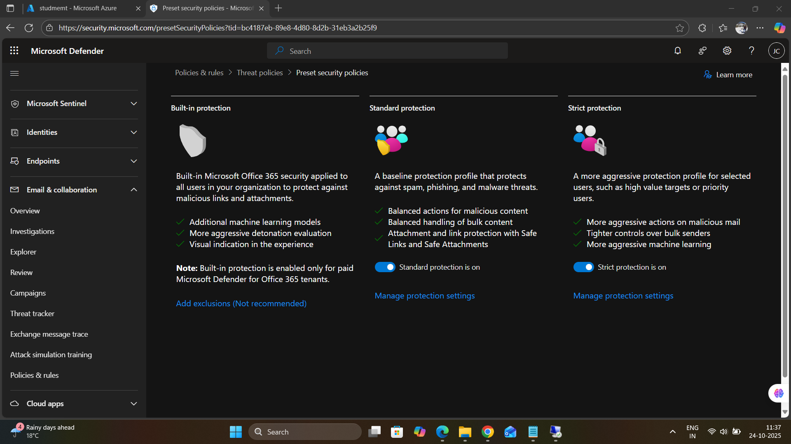
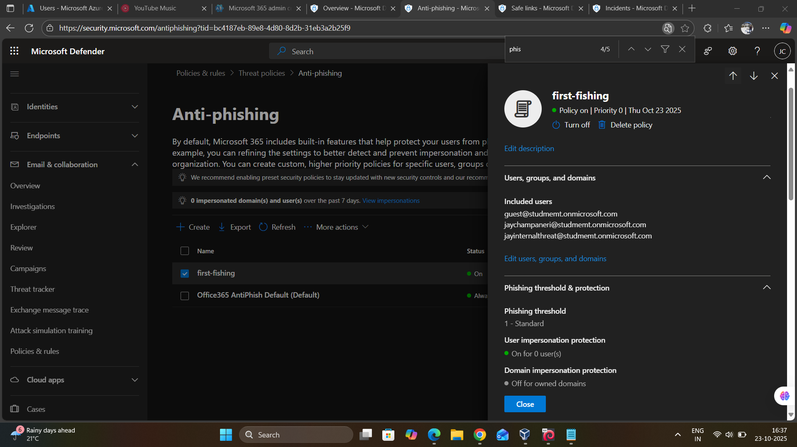
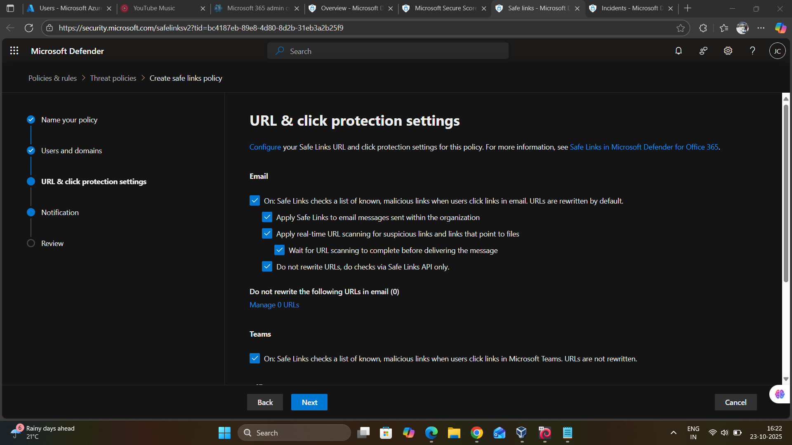
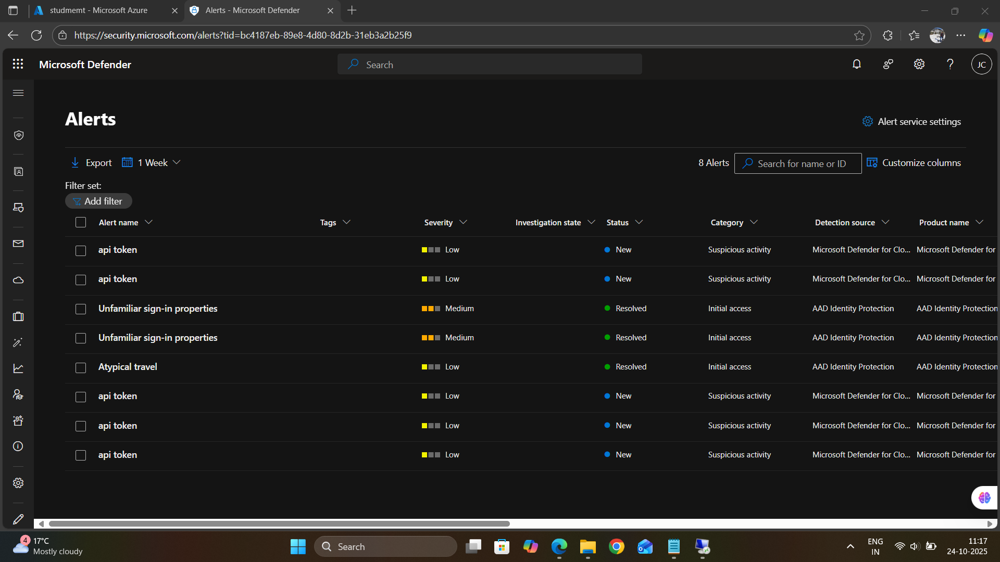
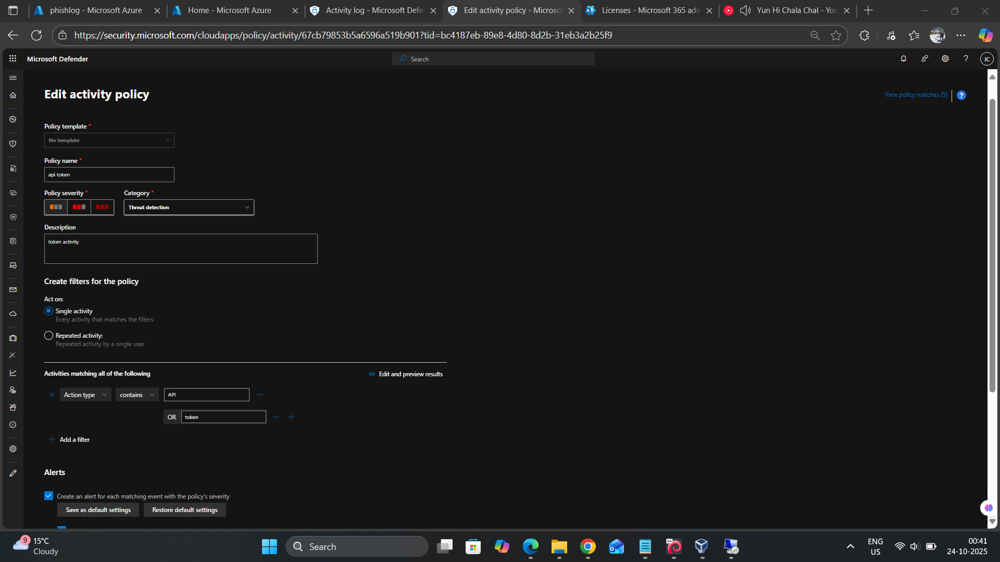

### Phase 3: Microsoft Defender for Office 365 Setup

**Objective:** Implement email security controls and threat detection

#### 3.1 Preset Security Policies

Configured three-tier protection model:

| Protection Level | Configuration | Use Case |
|-----------------|---------------|----------|
| **Built-in Protection** | Default Office 365 security for all users | Baseline protection against known threats |
| **Standard Protection** | Balanced spam, phishing, and malware detection | Medium-risk users and general workforce |
| **Strict Protection** | Aggressive filtering for high-value targets | Executives, IT admins, sensitive accounts |

**Screenshot Reference:** `05-preset-security-policies.png`

#### 3.2 Anti-Phishing Policy Configuration

**Custom Policy:** "first-fishing" (intentional naming for testing)
- **Included Users:**
  - `guest@studmemt.onmicrosoft.com`
  - `jaychampaneri@studmemt.onmicrosoft.com`
  - `jayinternalthreat@studmemt.onmicrosoft.com`

**Phishing Threshold & Protection:**
- Threshold Level: **1 - Standard** (balanced detection)
- User Impersonation Protection: **Enabled** (0 users configured)
- Domain Impersonation Protection: **Off** for owned domains

**Screenshot Reference:** 

#### 3.3 Safe Links Policy

**URL Scanning Configuration:**
- ✅ Safe Links checks list of known malicious links on email click
- ✅ Apply Safe Links to internal email messages
- ✅ Apply real-time URL scanning for suspicious links and files
- ✅ Wait for URL scanning to complete before message delivery
- ✅ Do not rewrite URLs (checks via Safe Links API only)

**Screenshot Reference:** 

---

### Phase 4: Microsoft Defender Portal Configuration

**Objective:** Centralize security monitoring and incident response

#### 4.1 Alert Service Configuration
- Enabled automatic alert generation
- Configured severity-based alerting:
  - 🔴 **Critical** - API token suspicious activity
  - 🟠 **Medium** - Unfamiliar sign-in properties
  - 🟢 **Low** - Atypical travel, API token activity

**Screenshot Reference:** 

#### 4.2 Identity Management

**User Inventory:**
- Total Identities: **304**
- Critical Priority: **1** (Administrator account)
- Disabled Accounts: **3**
- Service Accounts: **296**

#### 4.3 Cloud Activity Monitoring

**Activity Policy Creation:**
- Policy Name: "api token"
- Policy Severity: **Low**
- Category: **Threat detection**
- Description: "token activity"

**Filter Criteria:**
- Act on: **Single activity**
- Activity Type: Contains "API" OR "token"

**Alerts:** Create alert for each matching event

**Screenshot Reference:** 

---
