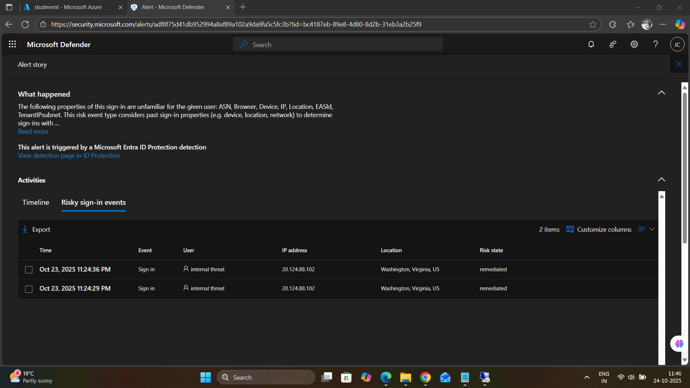
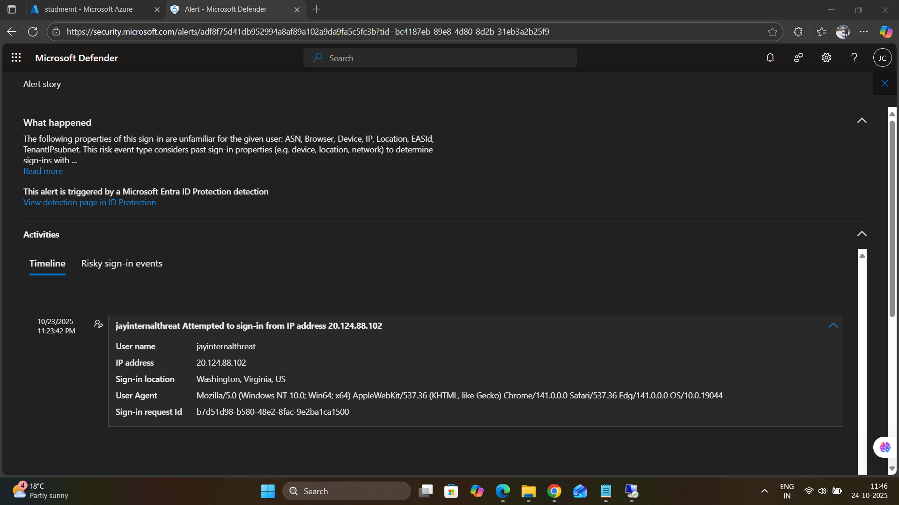
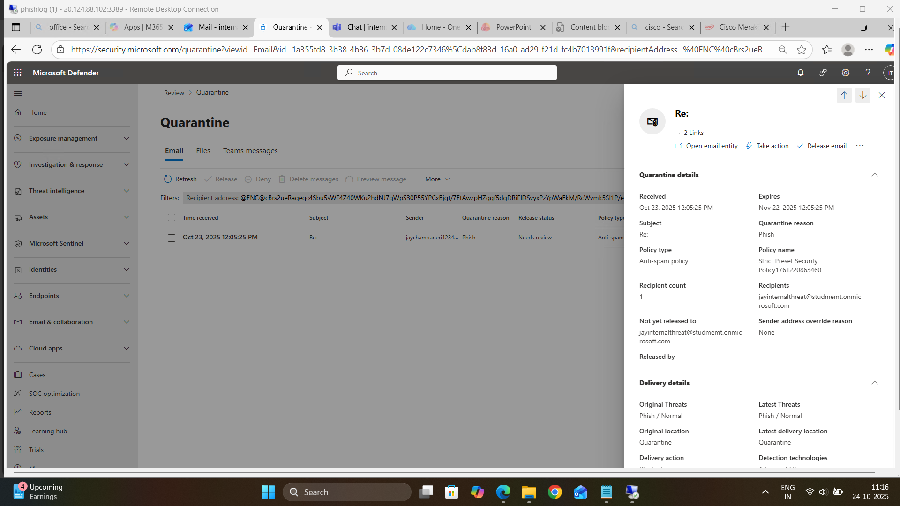
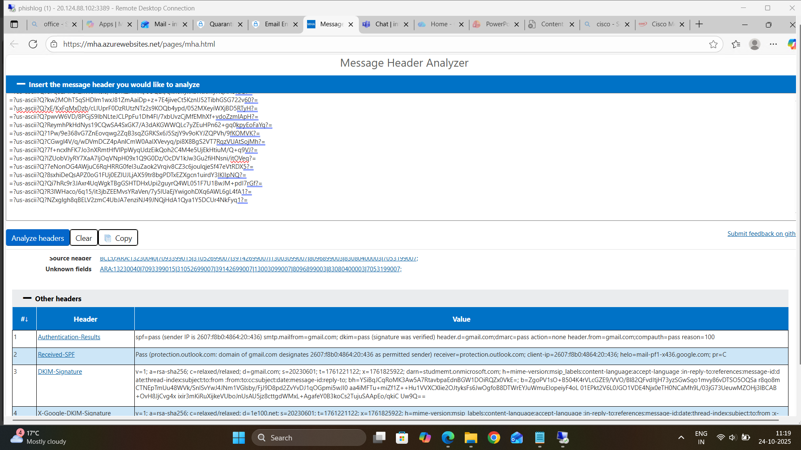
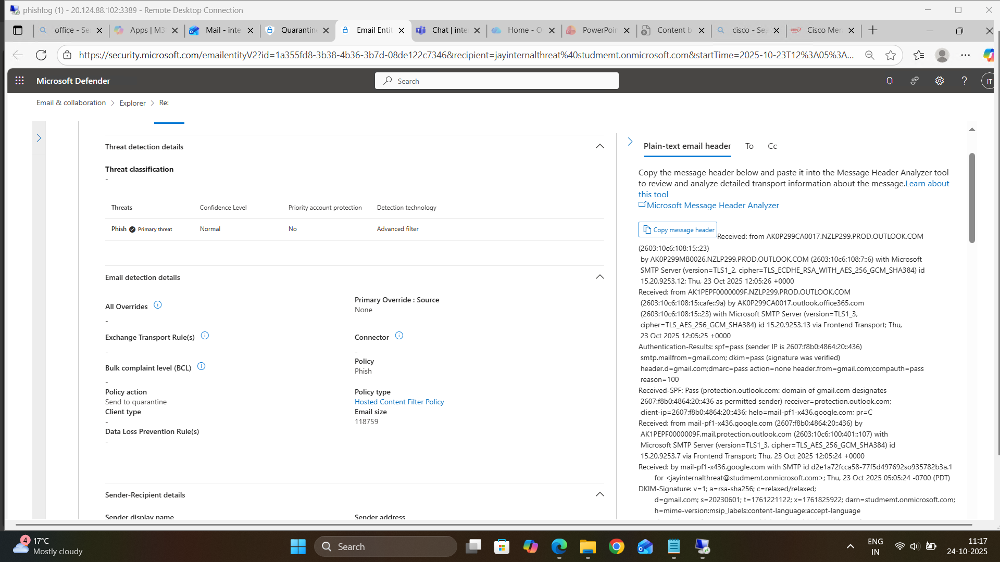

## 🚨 Detection & Alerts

### Phase 8: Security Event Detection

**Objective:** Analyze automated threat detection across Microsoft security stack

#### 8.1 Microsoft Entra ID Protection Alerts

**Alert Triggered:** Unfamiliar Sign-in Properties

**Alert Details:**
- **User:** `jayinternalthreat@studmemt.onmicrosoft.com`
- **Time:** Oct 23, 2025 11:23:42 PM
- **Source IP:** `20.124.88.102` (Washington, Virginia, US)
- **Severity:** Medium
- **Risk State:** Remediated
- **Detection:** Microsoft Entra ID Protection

**What Happened:**
Sign-in properties were unfamiliar compared to user's typical behavior:
- New ASN (Autonomous System Number)
- New browser type
- New device
- New IP address location
- New location
- New EASId (Exchange ActiveSync ID)
- New TenantIPSubnet

**Screenshot Reference:** 

#### 8.2 Risky Sign-in Timeline

**User Agent:** Mozilla/5.0 (Windows NT 10.0; Win64; x64) AppleWebKit/537.36 (KHTML, like Gecko) Chrome/141.0.0.0 Safari/537.36 Edg/141.0.0.0 OS/10.0.19044

**Sign-in Request ID:** b7d51d98-b580-48a2-8fac-9e2ba1ca1500

**Screenshot Reference:** 

---

### Phase 9: Advanced Threat Detection

#### 9.1 Defender for Cloud Apps - API Token Activity

**Alert Name:** "api token"

**Alert Summary:**
- **Status:** New (8 occurrences)
- **Severity:** Low
- **Category:** Suspicious activity
- **Detection Source:** Microsoft Defender for Cloud Apps

#### 9.2 Email Quarantine Analysis

**Quarantined Email:**
- **Received:** Oct 23, 2025 12:05:25 PM
- **Subject:** Re:
- **Sender:** jaychampaneri1234...@gmail.com (Phish)
- **Recipient:** jayinternalthreat@studmemt.onmicrosoft.com
- **Quarantine Reason:** Phish
- **Policy Type:** Anti-spam policy
- **Policy Name:** Strict Preset Security Policy [761220863460]
- **Release Status:** Needs review
- **Expiration:** Nov 22, 2025 12:05:25 PM

**Delivery Details:**
- **Original Threats:** Phish / Normal
- **Detection Technologies:** Advanced filter

**Screenshot Reference:**  

#### 9.3 Email Header Analysis

**Message Header Analyzer Results:**

**Authentication Results:**
- ✅ **SPF:** Pass (sender IP 2607:f8b0:4864:20::436)
- ✅ **DKIM:** Pass (signature verified)
- ❌ **DMARC:** Pass action=none

**Received Path:**
1. From: `gmail.com` (2607:f8b0:4864:20::436)
2. By: `AK0P299MB0026.NZLP299.PROD.OUTLOOK.COM` (Microsoft SMTP Server)
3. Final Destination: `AK1PEPF00000009F.NZLP299.PROD.OUTLOOK.COM`

**SMTP Transport:**
- Version: TLS1_3
- Cipher: TLS_AES_256_GCM_SHA384
- Microsoft SMTP Server ID: 15.20.9253.13

**Screenshot Reference:**  

#### 9.4 Threat Detection in Microsoft Defender

**Email Entity Analysis:**
- **Threat Classification:** Phish
- **Confidence Level:** Normal
- **Policy:** Hosted Content Filter Policy
- **Action:** Send to quarantine
- **Client Type:** Phish

**Sender Details:**
- **Display Name:** Unknown
- **Policy Action:** Quarantine
- **Email Size:** 118759 bytes

**Screenshot Reference:**  

---
