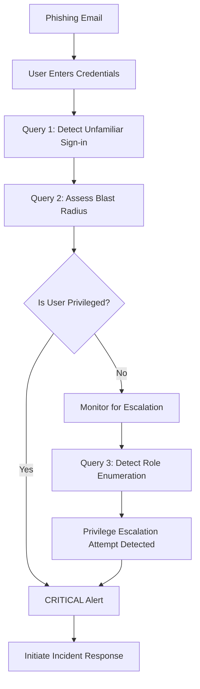

## 🚨 Query 3: Detecting Privileged Role Management Activities

### Purpose
Detects reconnaissance and privilege escalation attempts by identifying users who are enumerating role management capabilities or querying all groups via Microsoft Graph API - common precursors to privilege escalation attacks.

### Attack Context

**The Attacker's Perspective:**
After compromising a standard user account (e.g., through phishing), attackers follow this playbook:

1. **Reconnaissance**: "What permissions do I have?"
2. **Enumeration**: "What privileged roles exist in this tenant?"
3. **Target Selection**: "Which accounts should I compromise next?"
4. **Privilege Escalation**: "How do I elevate my access?"

This query catches steps 1-3.

### The Detection Logic

```kusto
// Get most recent identity info to join later, including blast radius indicators
let RecentIdentityInfo = IdentityInfo
    | where TimeGenerated > ago(10d)
    | extend 
        // Parse assigned roles from JSON format
        ParsedRoles = iff(isnotempty(AssignedRoles) 
            and AssignedRoles != "[]"
            , parse_json(AssignedRoles)
            , dynamic([]))
        // Parse group memberships from JSON format
        , ParsedGroups = iff(isnotempty(GroupMembership) 
            and GroupMembership != "[]"
            , parse_json(GroupMembership)
            , dynamic([]))
        // Check for privileged roles
        , IsAdmin = iff(isnotempty(AssignedRoles) 
            and AssignedRoles != "[]"
            , true, false)
        , IsPrivilegedRole = iff(
            AssignedRoles has_any("Global Administrator", "Privileged Role Administrator"
                , "User Administrator", "SharePoint Administrator", "Exchange Administrator"
                , "Hybrid Identity Administrator", "Application Administrator"
                , "Cloud Application Administrator")
                , true, false
        ),
        // Check for privileged group memberships
        IsInPrivilegedGroup = iff(
            GroupMembership has_any("AdminAgents", "Azure AD Joined Device Local Administrators"
                , "Directory Synchronization Accounts", "Domain Admins", "Enterprise Admins"
                , "Schema Admins", "Key Admins")
                , true, false
        )
        , EmployeeId = JobTitle
        , Department = Department
        , Manager = Manager
    // Take only the most recent record per account
    | summarize arg_max(TimeGenerated, *) by AccountObjectId; 

// Find Graph API calls accessing role management or generic groups
MicrosoftGraphActivityLogs
| where UserAgent has "PowerShell"
| where RequestUri == "https://graph.microsoft.com/beta/roleManagement/directory/estimateAccess" 
    or RequestUri == "https://graph.microsoft.com/v1.0/groups"
| join kind = leftouter AADNonInteractiveUserSignInLogs
    on $left.SignInActivityId == $right.UniqueTokenIdentifier
| join kind = leftouter RecentIdentityInfo
    on $left.UserId == $right.AccountObjectId
| where isnotempty(UserId) // Only include records where we have a valid UserId
| extend 
    UserDisplayName = iff(isnotempty(AccountDisplayName)
    , AccountDisplayName, UserDisplayName)
    , RoleCount = iff(isnotempty(ParsedRoles)
    , array_length(ParsedRoles), 0)
    , GroupCount = iff(isnotempty(ParsedGroups)
    , array_length(ParsedGroups), 0)
    , KeyAdminGroups = iff(isnotempty(ParsedGroups)
    , set_intersect(ParsedGroups, dynamic(["AdminAgents", "Azure AD Joined Device Local Administrators"
        , "Directory Synchronization Accounts", "Domain Admins", "Enterprise Admins"
        , "Schema Admins", "Key Admins", "Azure DevOps Administrators", "Security Administrators"
        , "Global Readers"]))
        , dynamic([]))
        , AccessType = case(
        RequestUri == "https://graph.microsoft.com/beta/roleManagement/directory/estimateAccess"
            , "Role Management Access Estimation",
        RequestUri == "https://graph.microsoft.com/v1.0/groups"
            , "All Groups Enumeration", "Other Access"
        )
// Add filters to reduce the number of results
| where ResultType == 0 or isnull(ResultType) // Only successful sign-ins or when ResultType isn't available
| summarize 
    RequestCount = count()
    , FirstActivity = min(TimeGenerated)
    , LastActivity = max(TimeGenerated)
    , RequestURIs = make_set(RequestUri, 10)
    , UserAgents = make_set(UserAgent, 5)
    , AccessTypes = make_set(AccessType)
    by 
    UserId, UserDisplayName,AccountUPN, UserPrincipalName, IPAddress,Department,EmployeeId
        , Manager,IsAdmin,IsPrivilegedRole,IsInPrivilegedGroup,tostring(ParsedRoles)
        ,RoleCount,tostring(KeyAdminGroups),GroupCount
| extend 
    BlastRadiusSeverity = case(
        IsPrivilegedRole == true, "Critical",
        IsAdmin == true 
            or IsInPrivilegedGroup == true, "High",
        RoleCount > 0, "Medium",
        "Low"
    ),
    ActivityDurationMinutes = datetime_diff('minute', LastActivity, FirstActivity)
    , UniqueEndpointsAccessed = array_length(RequestURIs)
| order by BlastRadiusSeverity asc, RequestCount desc, ActivityDurationMinutes desc
```

### Deep Dive: Attack Patterns Detected

#### Pattern 1: Role Management Enumeration
```kusto
| where RequestUri == "https://graph.microsoft.com/beta/roleManagement/directory/estimateAccess"
```

**What this API call does:**
- Returns list of ALL role assignments in the tenant
- Shows which users have privileged roles
- Reveals the organizational privilege structure

**Why attackers use it:**
- Identifies high-value targets for lateral movement
- Maps out privilege hierarchy for escalation paths
- Discovers service accounts with elevated access

**Legitimate vs. Malicious:**
| Legitimate Use | Malicious Use |
|----------------|---------------|
| IT admin auditing roles | Compromised user reconnaissance |
| Automated compliance scanning | Privilege escalation planning |
| Security tool baseline collection | Lateral movement target identification |

**Red Flags:**
- ❌ Called by standard user (not IT/Security)
- ❌ Called via PowerShell (not admin portal)
- ❌ Multiple calls in short timeframe
- ❌ Followed by unusual authentication attempts

#### Pattern 2: All Groups Enumeration
```kusto
| where RequestUri == "https://graph.microsoft.com/v1.0/groups"
```

**What this API call does:**
- Lists ALL security groups and distribution lists
- Reveals group memberships and access patterns
- Shows which groups have privileged access

**Why attackers use it:**
- Identify security group structures
- Find groups with sensitive resource access
- Locate privileged groups to target for membership addition

**Attack Chain Example:**
```
1. Phish standard user → Success
2. Enumerate all groups → Discover "SharePoint Admins" group
3. Identify members of that group → Target next phishing campaign
4. Compromise SharePoint Admin → Access sensitive documents
```

#### Pattern 3: PowerShell-Based Access
```kusto
| where UserAgent has "PowerShell"
```

**Why this matters:**
- Interactive users typically use web portal or Microsoft 365 apps
- PowerShell indicates programmatic/scripted access
- Common tool for post-exploitation activities

**Attack Tools That Use PowerShell:**
- **AADInternals**: PowerShell module for Entra ID manipulation
- **MicroBurst**: Azure exploitation framework
- **PowerZure**: Azure post-exploitation toolkit
- **Custom scripts**: Attacker-developed automation

### Enrichment with Identity Context

The query joins three data sources for complete context:

```kusto
MicrosoftGraphActivityLogs  // What API calls were made
  ↓
AADNonInteractiveUserSignInLogs  // Authentication context
  ↓
IdentityInfo  // User roles and privileges
```

**Why this matters:**

**Scenario A: Standard User Making Calls**
```
User: john.doe@company.com
Roles: None
Action: Enumerating role management
Severity: 🔴 HIGH - Potential compromise
```
→ **Alert: Standard user shouldn't query role management**

**Scenario B: IT Admin Making Calls**
```
User: admin@company.com
Roles: Global Administrator
Action: Enumerating role management
Severity: 🟢 LOW - Expected behavior
```
→ **Informational: Expected administrative activity**

### Analytics: Aggregation and Scoring

#### Request Count Analysis
```kusto
| summarize 
    RequestCount = count()
    , FirstActivity = min(TimeGenerated)
    , LastActivity = max(TimeGenerated)
```

**Normal Behavior:**
- 1-2 requests per day from IT admins
- Consistent timing (during business hours)
- From known admin IPs

**Suspicious Behavior:**
- **10+ requests in 1 hour** → Automated scanning
- **Activity at 2 AM** → Off-hours reconnaissance
- **Requests from VPN/proxy** → Hiding true location

#### Blast Radius Calculation
```kusto
| extend 
    BlastRadiusSeverity = case(
        IsPrivilegedRole == true, "Critical",
        IsAdmin == true or IsInPrivilegedGroup == true, "High",
        RoleCount > 0, "Medium",
        "Low"
    )
```

**Impact Assessment:**

| Severity | User Type | Potential Damage | Response Time |
|----------|-----------|------------------|---------------|
| 🔴 Critical | Privileged admin | Full tenant compromise | < 15 minutes |
| 🟠 High | Admin/Privileged group | Multi-system access | < 1 hour |
| 🟡 Medium | User with roles | Department-level impact | < 4 hours |
| 🟢 Low | Standard user | Limited scope | < 24 hours |

### Real-World Detection Example

**Alert Triggered:**
```
User: jayinternalthreat@studmemt.onmicrosoft.com
Action: Role Management Enumeration
RequestCount: 15
Duration: 8 minutes
UserAgent: PowerShell/7.3.0
IP: 20.124.88.102 (Virginia, US)
IsPrivilegedRole: False
BlastRadiusSeverity: Low → Elevated to HIGH (suspicious behavior)
```

**Investigation Steps:**

1. **Context Check:**
   - User is in Engineering department (not IT)
   - No admin roles assigned
   - Activity at 11:23 PM (off-hours)
   - IP located in Virginia (user normally in Auckland)

2. **Recent Authentication:**
   - Unfamiliar sign-in properties detected
   - MFA completed (but session token captured via phishing)

3. **Conclusion:**
   - Account compromised via phishing
   - Attacker performing reconnaissance
   - Attempting to identify privilege escalation paths

4. **Response:**
   - Revoke all sessions immediately
   - Force password reset
   - Review recent access logs
   - Check for any unauthorized changes

### False Positive Reduction

```kusto
| where ResultType == 0 or isnull(ResultType) // Only successful calls
```

**Why filter on success:**
- Failed calls = legitimate user with insufficient permissions (expected)
- Successful calls from non-admin = compromise indicator

**Additional Tuning:**

```kusto
// Exclude known admin accounts
| where UserPrincipalName !has "admin"

// Exclude service accounts
| where UserPrincipalName !startswith "svc-"

// Exclude during business hours if IT regularly audits
| where hourofday(TimeGenerated) !between (9 .. 17)
```

### Integration with Incident Response

**Automated Response Actions:**

```kusto
// This query can trigger Logic App playbook:
// 1. Create high-priority incident in Sentinel
// 2. Revoke user sessions via Graph API
// 3. Send alert to SOC team via Teams/Email
// 4. Block user sign-ins temporarily
// 5. Initiate automated investigation
```

### Metrics and Tuning

**Query Performance:**
- Lookback: 10 days (adjustable)
- Execution time: ~15-30 seconds
- Results: Typically 0-5 alerts per day

**Tuning Recommendations:**
- **High false positive rate?** → Add exclusions for admin accounts
- **Missing detections?** → Expand role list to include custom roles
- **Performance issues?** → Reduce lookback window to 7 days

---

## 🎯 Detection Strategy Summary

### Coverage Map

| Attack Stage | Query 1 (UnifiedSignInLogs) | Query 2 (IdentityInfo) | Query 3 (Role Enumeration) |
|--------------|----------------------------|------------------------|---------------------------|
| Initial Access | ✅ Detects abnormal sign-ins | ✅ Identifies target value | ❌ |
| Reconnaissance | ❌ | ❌ | ✅ Detects enumeration |
| Privilege Escalation | ✅ Detects elevation attempts | ✅ Tracks role changes | ✅ Detects recon |
| Lateral Movement | ✅ Detects unusual access | ✅ Maps blast radius | ✅ Identifies targets |

### Combined Detection Workflow



### Key Takeaways

1. **Layer Your Detections**: No single query catches everything
2. **Enrich with Context**: Identity data transforms alerts into actionable intelligence
3. **Reduce False Positives**: Filtering by role and behavior minimizes noise
4. **Automate Response**: KQL queries can trigger automated remediation
5. **Document Everything**: Clear query logic helps junior analysts learn

---

## 📚 Additional Resources

### Learning KQL
- [Microsoft Sentinel KQL Documentation](https://learn.microsoft.com/en-us/azure/sentinel/kusto-query-language)
- [Kusto Detective Agency](https://detective.kusto.io/) - Interactive KQL learning
- [Must Learn KQL Series](https://github.com/rod-trent/MustLearnKQL)

### Detection Engineering
- [MITRE ATT&CK Framework](https://attack.mitre.org/)
- [Microsoft Sentinel Detection Rules](https://github.com/Azure/Azure-Sentinel)
- [Sigma Rules](https://github.com/SigmaHQ/sigma)

### Query Optimization
- [KQL Best Practices](https://learn.microsoft.com/en-us/azure/data-explorer/kusto/query/best-practices)
- [Performance Tuning](https://learn.microsoft.com/en-us/azure/sentinel/query-performance)

---

## 🤝 Contributing

Found an improvement or have a detection query to share? Contributions welcome!

**Areas for Enhancement:**
- Additional privilege escalation detection patterns
- Performance optimization suggestions
- False positive reduction techniques
- Real-world incident case studies

---

## ⚠️ Important Notes

**Testing Environment:**
- All queries tested in isolated lab environment
- Validated against Microsoft 365 E5 + Defender stack
- Results may vary based on tenant configuration

**Production Deployment:**
- Test thoroughly before deploying to production
- Adjust thresholds based on your environment
- Monitor for false positives in first 2 weeks
- Document exclusions and tuning decisions

**Privacy Considerations:**
- These queries access user identity and authentication data
- Ensure compliance with organizational data handling policies
- Log all query executions for audit trail
- Restrict access to authorized security personnel only

---

*Last Updated: November 2025*  
*Author: Jay Champaneri*  
*Project: Phishing Attack Simulation & Incident Response Lab*
