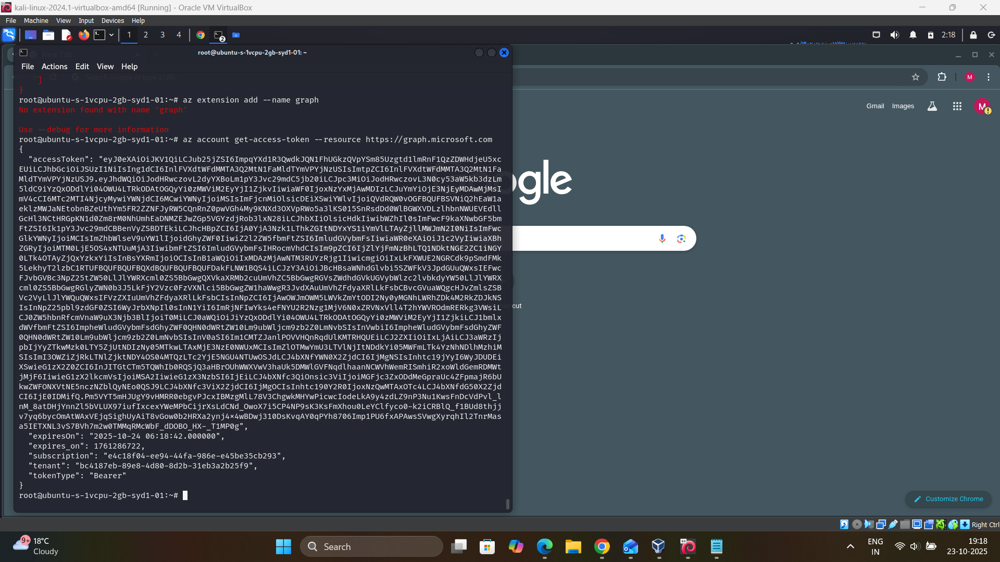

## 🎣 Attack Simulation

### Tool 1 :  Evilginx Phishing Framework Setup

**Objective:** Deploy advanced man-in-the-middle phishing infrastructure



#### 5.1 Evilginx Installation & Configuration

**Attack Machine Details:**
- **Hostname:** `ubuntu-s-1vcpu-2gb-syd1-01`
- **IP Address:** `20.124.88.102` (Azure public IP)
- **Tool:** Evilginx v3.x

**Commands Executed:**
```bash
# Add Microsoft Graph extension for Azure management
az extension add --name graph

# Retrieve Azure access token for authentication
az account get-access-token --resource https://graph.microsoft.com
```

**Token Details:**
- Access Token: `eyJ0eXAiOi1...` (truncated for security)
- Expiration: `2025-10-24 06:18:42.000000`
- Subscription: `eac18f84-ee9a-44fa-986e-e45be35cb293`
- Tenant: `bc4187eb-89e8-4d80-8d2b-31eb3a2b25f9`
- Token Type: Bearer

**Screenshot Reference:** `11-evilginx-azure-token.png`

#### 5.2 O365 Phishlet Deployment

**Phishlet Configuration:**
- Target Service: Microsoft Office 365
- Lure Template: Office 365 login page replica
- MFA Bypass: Enabled (token capture)

---

### Phase 6: Credential Harvesting Attack

**Objective:** Simulate user falling for phishing attack and capture authentication tokens

#### 6.1 Phishing Email Delivery
- **Delivery Method:** Direct phishing link (email simulation bypassed for lab)
- **Target User:** `jayinternalthreat@studmemt.onmicrosoft.com`
- **Social Engineering:** Fake Office 365 login prompt

#### 6.2 Victim Interaction
1. Victim clicks malicious link
2. Redirected to Evilginx-hosted fake O365 login page
3. Enters valid credentials: `jayinternalthreat@studmemt.onmicrosoft.com`
4. Completes legitimate Microsoft MFA (Evilginx proxies session)
5. Evilginx captures:
   - Username and password
   - Session cookies
   - Authentication tokens

#### 6.3 Token Extraction
**Captured Authentication Token:**
- Token successfully harvested via Evilginx
- Includes all necessary session cookies for account access
- Bypasses MFA due to valid session token

--

#### 7 Cookie Injection

**Tool Used:** Browser Cookie Editor Extension

**Process:**
1. Opened browser in clean session (no prior authentication)
2. Navigated to `https://outlook.office.com`
3. Injected captured session cookies using Cookie Editor
4. Refreshed page


### Tool 2 - IPGhost - Geographic Evasion Testing Tool

.png)
🌍 Overview
IPGhost (also known as IRPGhost or IPGhost1) is a sophisticated identity obfuscation tool used in this lab to simulate advanced threat actors who employ geographic evasion techniques. The tool rapidly rotates through proxy servers across multiple countries, making it difficult for security systems to track the true origin of attacks.

🎯 Purpose in This Lab
Educational Context
This tool was used to test and validate the effectiveness of Microsoft Defender's geographic anomaly detection and impossible travel alerts. By simulating an attacker using multiple international proxy servers, we could verify that:

✅ Microsoft Entra ID Protection detects atypical travel patterns
✅ Conditional Access policies respond to geographic risk signals
✅ Sentinel analytics rules correlate suspicious location changes
✅ User risk scores escalate appropriately

Attack Simulation Scenario
Threat Actor Profile Simulated:

Sophistication Level: Advanced Persistent Threat (APT)
Evasion Techniques: Geographic dispersion, IP rotation
Attack Pattern: Multi-stage phishing with location masking
Detection Avoidance: Attempts to blend with legitimate international traffic

---
