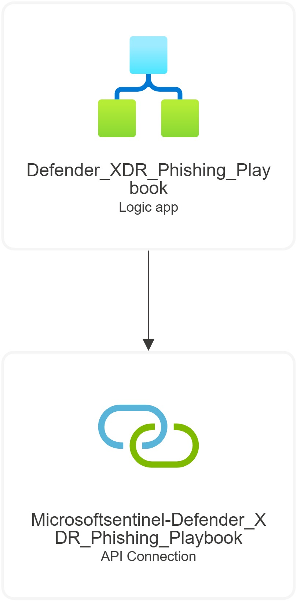
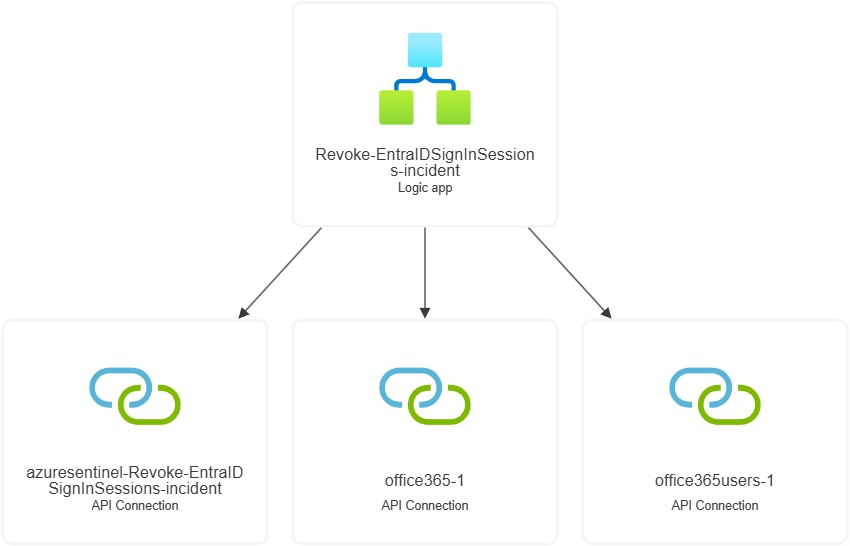
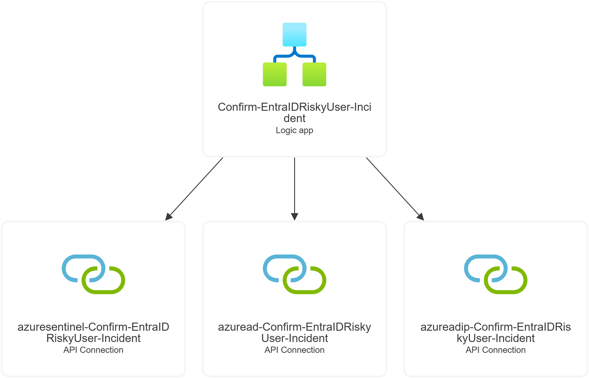

***1. DefenderXDR-Phishing-Playbook***

Purpose:
Guide Security Operations (SOC) teams through manual response steps for phishing incidents.

Workflow Overview:

Triggered by a Sentinel incident containing phishing-related alerts.

Checks for alert keywords (e.g., “Phish”, “ZAP”, “URL click”).

Automatically creates and organizes Sentinel tasks for each response stage:

Introduction

Contain

Investigate

Investigate Involved Users

Remediate

Prevent

Each task includes investigation and remediation guidance with Microsoft documentation links.

Connections Used:

Microsoft Sentinel

***2. Revoke-EntraIDSignInSessions-Incident***

Purpose:
Automatically revoke Entra ID (Azure AD) user sign-in sessions for accounts involved in a Sentinel incident.

Workflow Overview:

Triggered by a new Sentinel incident.

Retrieves related user accounts from the incident.

Uses Microsoft Graph API to revoke user sign-in sessions.

Retrieves the user’s manager via Microsoft 365.

Sends an email notification to the manager.

Adds an incident comment confirming the action.

Connections Used:

Azure Sentinel

Office 365 Users

Office 365 Mail

***3. Confirm-EntraIDRiskyUser-Incident***

Purpose:
Automatically confirm risky Entra ID users as compromised in Microsoft Sentinel incidents.

Workflow Overview:

Triggered by a Sentinel incident.

Retrieves related user accounts.

Looks up user details via Microsoft Graph.

Calls Microsoft Entra ID Protection API to mark the user as compromised.

Adds a confirmation comment to the incident.

Connections Used:

Azure Sentinel

Azure AD

Azure AD Identity Protection

