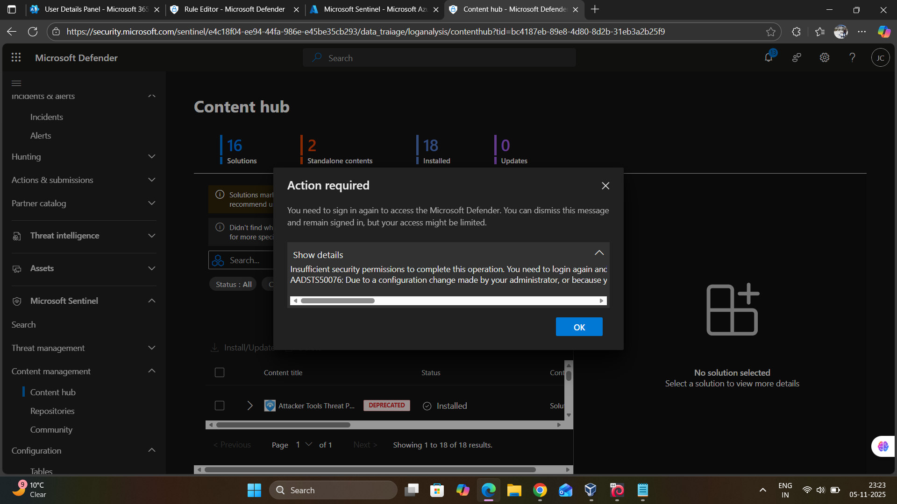
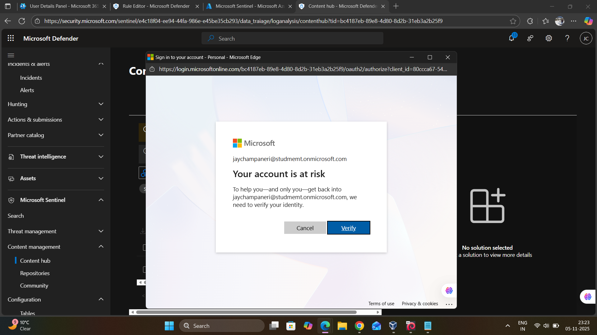
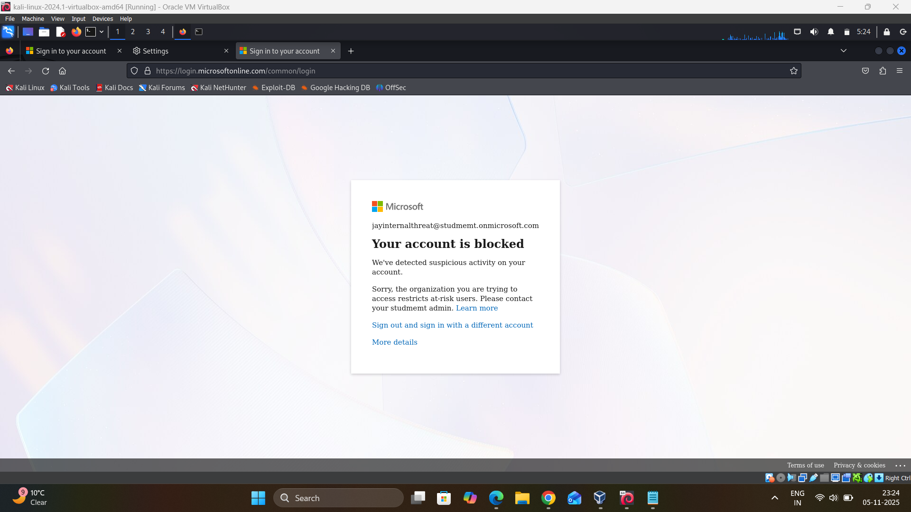
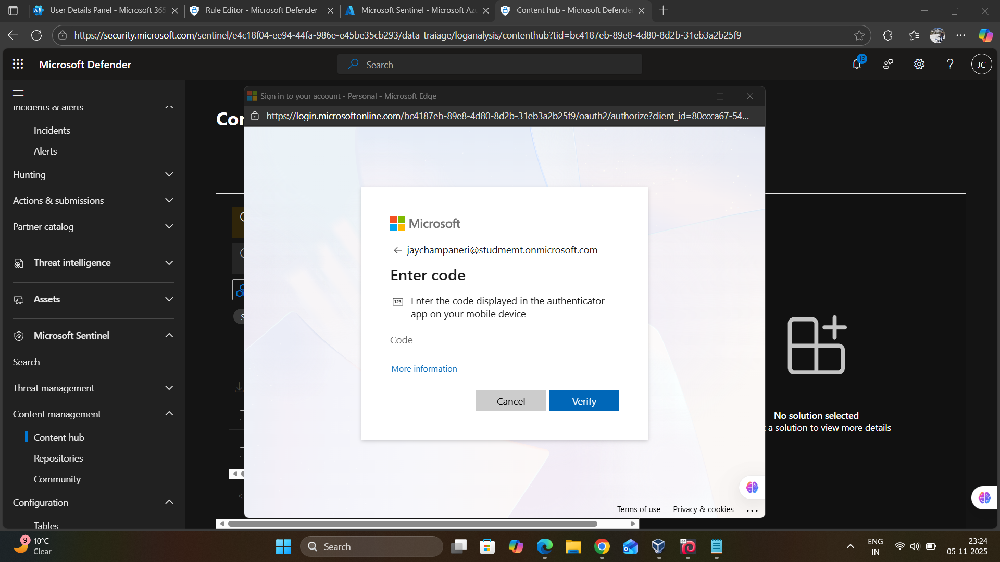
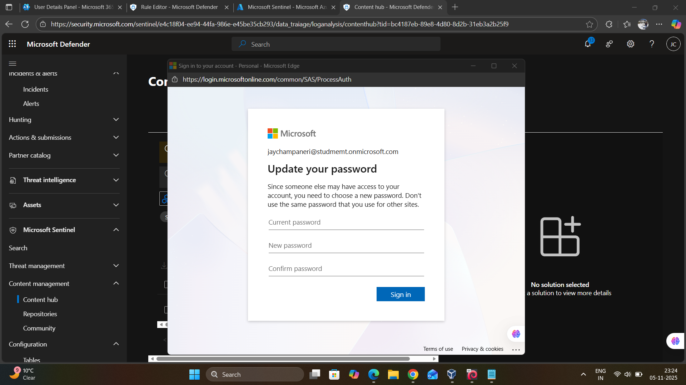
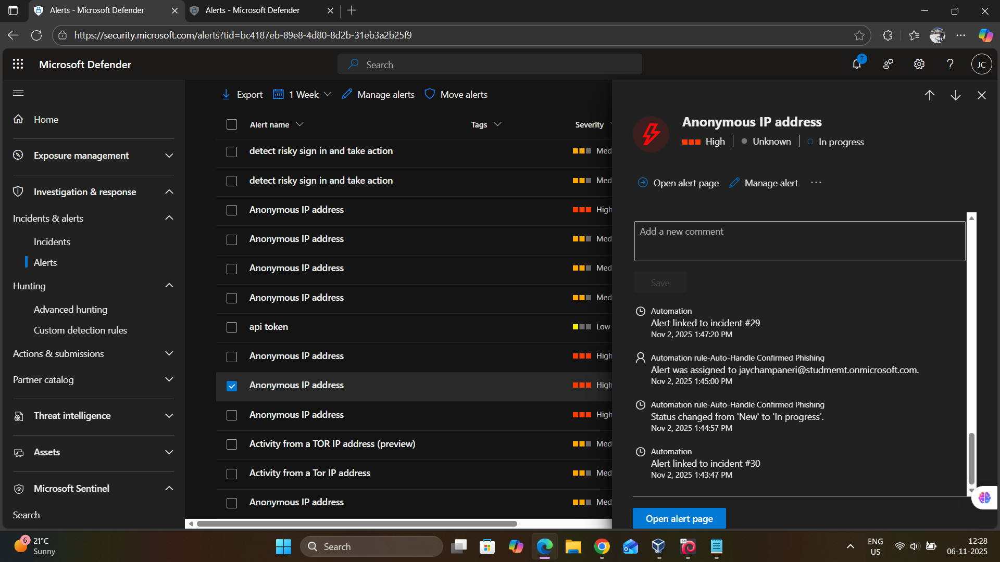
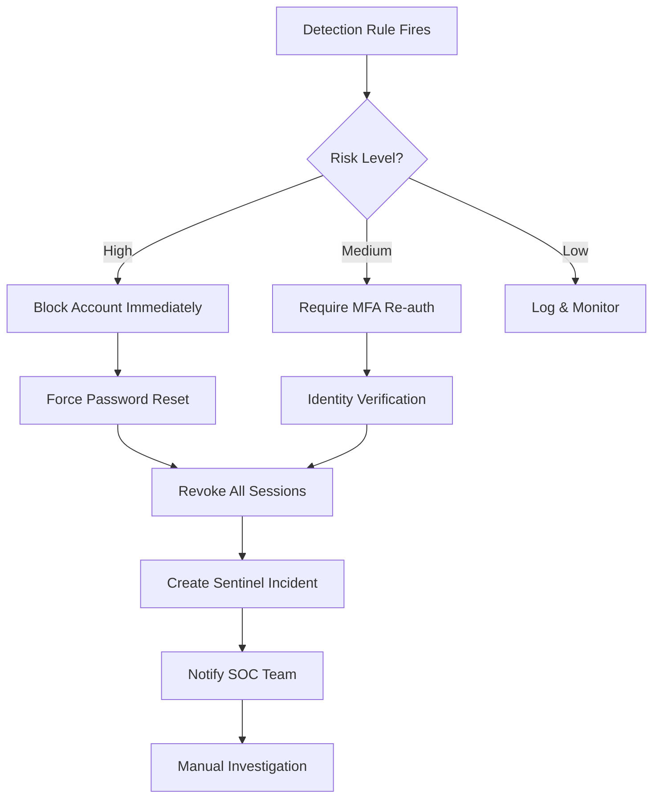

### Lab Detection Example




**Account at Risk**
```
Account: jaychampaneri@studmemt.onmicrosoft.com
Status: Your account is at risk
Message: "We've detected suspicious activity on your account"
Action Required: Verify identity
```



**Account Blocked**
```
Account: jayinternalthreat@studmemt.onmicrosoft.com
Status: Your account is blocked
Message: "Sorry, the organization you are trying to access restricts at-risk users"
Action: Contact admin / Learn more
```



**MFA Challenge**
```
Account: jaychampaneri@studmemt.onmicrosoft.com
Action: Enter code from authenticator app
Purpose: Identity verification before access granted
```



**Forced Password Change**
```
Account: jaychampaneri@studmemt.onmicrosoft.com
Message: "Since someone else may have access to your account, you need to choose a new password"
Required Fields:
- Current password
- New password
- Confirm password
```




### Incident Analysis

```
Multiple "Anonymous IP address" alerts visible
Severity: Mixed (High and Medium)
Status: Some resolved, some in progress
Automation: Linked to incidents
- Alert linked to incident #29
- Alert linked to incident #30
- Auto-assigned to jaychampaneri@studmemt.onmicrosoft.com
```




**Automation Actions:**
- Auto-Handle Confirmed Phishing playbook executed
- Status changed from "New" to "In progress"
- Automatic assignment to security analyst


## 🤖 Automated Response Integration

### Playbook Workflow

